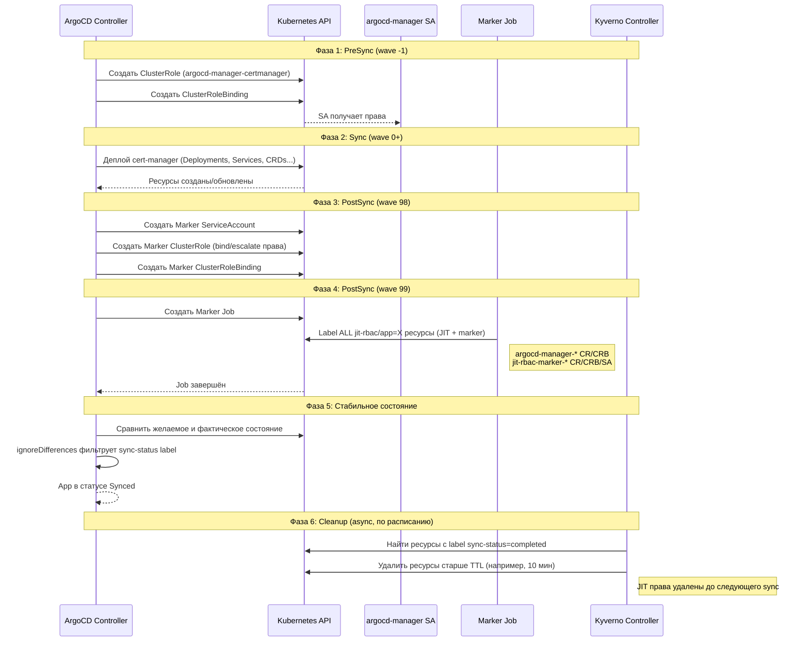

# JIT RBAC механизм для ArgoCD

## Обзор

JIT (Just-In-Time) RBAC — паттерн динамического предоставления RBAC-прав в Kubernetes во время sync-операций ArgoCD. Решает проблему курицы и яйца: ArgoCD нужны права для деплоя ресурсов, но эти права должны существовать только в момент синхронизации.

## Постановка проблемы

ArgoCD использует ServiceAccount (`argocd-manager`) для управления ресурсами на целевых кластерах. Традиционные подходы:

| Подход | Проблема |
|--------|----------|
| Cluster-admin | Избыточные права, нарушение принципа least-privilege |
| Статические ClusterRoles | Права сохраняются даже когда sync не выполняется |
| Namespace-scoped Roles | Не работает для cluster-scoped ресурсов (CRDs, ClusterRoles) |

**Решение JIT RBAC**: Выдавать права только во время sync, помечать их как "completed" после sync, настроить ArgoCD игнорировать diff на помеченных ресурсах. Удаление помеченных ресурсов выполняется внешним механизмом (Kyverno cleanup policies).

## Архитектура

```
┌─────────────────────────────────────────────────────────────────────────┐
│                          ArgoCD Application                              │
│                    (multi-source с jit_helm)                            │
└─────────────────────────────────────────────────────────────────────────┘
                                    │
                                    ▼
┌─────────────────────────────────────────────────────────────────────────┐
│                            ФАЗЫ SYNC                                     │
├─────────────────────────────────────────────────────────────────────────┤
│                                                                          │
│  ┌──────────────┐    ┌──────────────┐    ┌──────────────┐               │
│  │   PreSync    │───▶│     Sync     │───▶│   PostSync   │               │
│  │   wave -1    │    │   wave 0+    │    │  wave 98-99  │               │
│  └──────────────┘    └──────────────┘    └──────────────┘               │
│         │                   │                   │                        │
│         ▼                   ▼                   ▼                        │
│  ┌──────────────┐    ┌──────────────┐    ┌──────────────┐               │
│  │ ClusterRole  │    │   App Helm   │    │ Marker RBAC  │               │
│  │ ClusterRole- │    │    Chart     │    │ (SA, CR, CRB)│               │
│  │   Binding    │    │ (cert-manager│    │   wave 98    │               │
│  │              │    │  coredns...) │    ├──────────────┤               │
│  │ Выдаёт права │    │              │    │ Marker Job   │               │
│  │ для argocd-  │    │ Использует   │    │   wave 99    │               │
│  │ manager SA   │    │ выданные     │    │              │               │
│  └──────────────┘    │ права        │    │ Помечает ВСЕ │               │
│         │            └──────────────┘    │ JIT ресурсы  │               │
│         │                                │ как completed│               │
│         │                                └──────────────┘               │
│         │                                        │                       │
│         └────────────────────────────────────────┘                       │
│                              │                                           │
└──────────────────────────────┼───────────────────────────────────────────┘
                               │
                               ▼ label: jit-rbac/sync-status=completed
┌─────────────────────────────────────────────────────────────────────────┐
│                      KYVERNO CLEANUP (внешний)                           │
├─────────────────────────────────────────────────────────────────────────┤
│  CleanupPolicy отслеживает ресурсы с label sync-status=completed        │
│  и удаляет их по расписанию (например, через 10 минут после создания)   │
│                                                                          │
│  Удаляемые ресурсы:                                                      │
│  • argocd-manager-{app} ClusterRole + ClusterRoleBinding                │
│  • jit-rbac-marker-{app} ClusterRole + ClusterRoleBinding + SA          │
└─────────────────────────────────────────────────────────────────────────┘
```

## Диаграмма потока синхронизации



## Детали компонентов

### 1. JIT ClusterRole и ClusterRoleBinding

**Файл**: `templates/jit-rbac.yaml`

**Назначение**: Временная выдача прав ServiceAccount `argocd-manager`

**Аннотации**:
```yaml
argocd.argoproj.io/hook: PreSync           # Выполнить до основного sync
argocd.argoproj.io/hook-delete-policy: HookFailed  # Сохранить при успехе
argocd.argoproj.io/sync-wave: "-1"         # Первый в очереди
argocd.argoproj.io/sync-options: Prune=false       # Никогда не удалять
```

**Почему PreSync?** Права должны существовать ДО того, как ArgoCD попытается задеплоить ресурсы приложения.

**Почему Prune=false?** Предотвращает удаление ClusterRole при последующих sync (это hook, а не обычный ресурс).

### 2. Marker RBAC

**Файл**: `templates/marker-rbac.yaml`

**Назначение**: Создать отдельный ServiceAccount с правами на добавление label к JIT ресурсам

**Компоненты**:
- ServiceAccount: `jit-rbac-marker-{appName}`
- ClusterRole: Права на patch clusterroles, clusterrolebindings, serviceaccounts
- ClusterRoleBinding: Связывает SA с ClusterRole

**Критичные права**:
```yaml
verbs: ["get", "list", "patch", "update", "bind", "escalate"]
```

**Зачем bind/escalate?** Kubernetes запрещает модификацию ClusterRoles, содержащих права, которых нет у модифицирующего SA. `bind` и `escalate` обходят эту защиту.

### 3. Marker Job

**Файл**: `templates/marker-job.yaml`

**Назначение**: Проставить label `jit-rbac/sync-status=completed` на все JIT ресурсы

**Выполнение**:
```bash
kubectl label clusterrole -l jit-rbac/app=${APP} jit-rbac/sync-status=completed --overwrite
kubectl label clusterrolebinding -l jit-rbac/app=${APP} jit-rbac/sync-status=completed --overwrite
kubectl label serviceaccount -n ${NS} -l jit-rbac/app=${APP} jit-rbac/sync-status=completed --overwrite
```

**Почему wave 99?** Должен выполниться ПОСЛЕ создания marker RBAC (wave 98) и ПОСЛЕ sync всех ресурсов приложения.

### 4. ignoreDifferences в Application

**Назначение**: Предотвратить отображение drift на JIT ресурсах в ArgoCD

```yaml
ignoreDifferences:
  - group: rbac.authorization.k8s.io
    kind: ClusterRole
    jsonPointers:
      - /metadata/labels/jit-rbac~1sync-status  # ~1 = URL-encoded /
      - /metadata/annotations
  - group: rbac.authorization.k8s.io
    kind: ClusterRoleBinding
    jsonPointers:
      - /metadata/labels/jit-rbac~1sync-status
      - /metadata/annotations
```

**Зачем игнорировать sync-status label?** Label добавляется Marker Job после sync, он не определён в Git. Без ignoreDifferences ArgoCD показывал бы приложение как OutOfSync.

### 5. Kyverno Cleanup (внешний компонент)

**Назначение**: Удаление JIT ресурсов после завершения sync

**Важно**: JIT RBAC Helm chart НЕ содержит логики удаления ресурсов. Удаление выполняется внешними Kyverno CleanupPolicies, которые реагируют на label `jit-rbac/sync-status=completed`.

**Почему внешний механизм?**
- Разделение ответственности: JIT chart создаёт и помечает, Kyverno удаляет
- Гибкость: политики удаления можно настраивать независимо (TTL, условия, исключения)
- Централизация: одна Kyverno policy для всех JIT-enabled приложений

**Пример Kyverno CleanupPolicy**:
```yaml
apiVersion: kyverno.io/v2
kind: ClusterCleanupPolicy
metadata:
  name: cleanup-jit-rbac-completed
spec:
  match:
    any:
    - resources:
        kinds:
        - ClusterRole
        - ClusterRoleBinding
        selector:
          matchLabels:
            jit-rbac/sync-status: completed
  schedule: "*/5 * * * *"   # Каждые 5 минут
  conditions:
    any:
    - key: "{{ time_since('','{{ target.metadata.creationTimestamp }}', '') }}"
      operator: GreaterThan
      value: "10m"          # Удалять ресурсы старше 10 минут
```

**Помечаемые ресурсы** (все имеют label `jit-rbac/app`):

| Ресурс | Тип | Описание |
|--------|-----|----------|
| `argocd-manager-{app}` | ClusterRole | JIT права для приложения |
| `argocd-manager-{app}` | ClusterRoleBinding | Привязка прав к SA |
| `jit-rbac-marker-{app}` | ClusterRole | Права marker на labeling |
| `jit-rbac-marker-{app}` | ClusterRoleBinding | Привязка marker прав |
| `jit-rbac-marker-{app}` | ServiceAccount | SA для marker Job |

## Пошаговый алгоритм

### Первичная синхронизация

| Шаг | Фаза | Wave | Действие | Результат |
|-----|------|------|----------|-----------|
| 1 | PreSync | -1 | Создание ClusterRole `argocd-manager-certmanager` | Права определены |
| 2 | PreSync | -1 | Создание ClusterRoleBinding | `argocd-manager` SA получает права |
| 3 | Sync | 0+ | Деплой cert-manager (Deployments, CRDs и т.д.) | Ресурсы приложения созданы |
| 4 | PostSync | 98 | Создание Marker SA, ClusterRole, ClusterRoleBinding | Инфраструктура marker готова |
| 5 | PostSync | 99 | Запуск Marker Job | **Все** JIT ресурсы (включая marker-*) помечены `sync-status=completed` |
| 6 | - | - | ArgoCD сравнивает состояние | ignoreDifferences фильтрует diff по label |
| 7 | - | - | Статус приложения | **Synced** |
| 8 | Async | - | Kyverno CleanupPolicy срабатывает по расписанию | JIT ресурсы с `completed` удалены после TTL |

### Последующие синхронизации

| Шаг | Действие | Результат |
|-----|----------|-----------|
| 1 | ArgoCD обнаруживает изменение в Git | Sync запущен |
| 2 | PreSync hooks перезапускаются | ClusterRole/Binding обновлены (если rules изменились) |
| 3 | Фаза Sync | Ресурсы приложения обновлены |
| 4 | PostSync hooks перезапускаются | Marker Job повторно проставляет labels |
| 5 | Статус приложения | **Synced** |

## Конфигурация Values

```yaml
# Обязательные параметры
appName: k8s-spb2-backend1-certmanager    # Должен совпадать с именем ArgoCD Application
namespace: cert-manager                    # Целевой namespace
roleName: argocd-manager-certmanager       # Имя ClusterRole

# ServiceAccount, которому выдаются права
serviceAccountName: argocd-manager
serviceAccountNamespace: kube-system

# RBAC rules для приложения
rules:
  - apiGroups: ["cert-manager.io"]
    resources: ["certificates", "issuers"]
    verbs: ["create", "update", "patch", "get", "list", "watch", "delete"]
  # ... дополнительные rules

# Конфигурация marker
markerRole:
  enabled: true   # false если используется внешний marker механизм

# Образ контейнера для marker job
image: bitnami/kubectl:latest
```

## Структура файлов

```
jit_helm/
├── Chart.yaml
├── values.yaml                    # Значения по умолчанию
├── values-certmanager.yaml        # Rules для cert-manager
├── values-coredns.yaml            # Rules для coredns
├── values-dex-auth.yaml           # Rules для dex-auth
└── templates/
    ├── _helpers.tpl               # Helper-функции (labels, annotations)
    ├── jit-rbac.yaml              # ClusterRole + ClusterRoleBinding
    ├── marker-rbac.yaml           # Marker SA + ClusterRole + ClusterRoleBinding
    └── marker-job.yaml            # Mark-completed Job
```

## Пример манифеста Application

```yaml
apiVersion: argoproj.io/v1alpha1
kind: Application
metadata:
  name: k8s-spb2-backend1-certmanager
  namespace: argocd
spec:
  project: default
  destination:
    name: kind-test-1
    namespace: cert-manager
  
  ignoreDifferences:
    - group: rbac.authorization.k8s.io
      kind: ClusterRole
      jsonPointers:
        - /metadata/labels/jit-rbac~1sync-status
        - /metadata/annotations
    - group: rbac.authorization.k8s.io
      kind: ClusterRoleBinding
      jsonPointers:
        - /metadata/labels/jit-rbac~1sync-status
        - /metadata/annotations
  
  sources:
    # Source 1: JIT RBAC
    - repoURL: 'https://github.com/org/repo.git'
      targetRevision: HEAD
      path: jit_helm
      helm:
        releaseName: jit-certmanager
        valueFiles:
          - values-certmanager.yaml
    
    # Source 2: Helm chart приложения
    - repoURL: 'https://github.com/org/charts.git'
      targetRevision: HEAD
      path: cert-manager
      helm:
        releaseName: certmanager
        values: |
          installCRDs: true
```

## Аспекты безопасности

| Аспект | Реализация | Митигация рисков |
|--------|------------|------------------|
| Least privilege | ClusterRoles специфичны для приложения | Нет cluster-admin доступа |
| Область прав | Rules определены в values файлах | Легко аудитить, версионируются в Git |
| Права marker | bind/escalate только для marker SA | Ограничены операцией проставления labels |
| Сохранение hooks | Prune=false | Ресурсы переживают sync циклы |
| Очистка Jobs | ttlSecondsAfterFinished: 60 | Jobs удаляются автоматически после завершения |

## Troubleshooting

### Job падает с ошибкой "Forbidden"

**Причина**: В Marker ClusterRole отсутствуют verbs `bind`/`escalate`

**Решение**: Убедиться, что marker-rbac.yaml содержит:
```yaml
verbs: ["get", "list", "patch", "update", "bind", "escalate"]
```

### Приложение показывает OutOfSync на ClusterRole

**Причина**: Отсутствует ignoreDifferences для label `jit-rbac/sync-status`

**Решение**: Добавить в манифест Application:
```yaml
ignoreDifferences:
  - group: rbac.authorization.k8s.io
    kind: ClusterRole
    jsonPointers:
      - /metadata/labels/jit-rbac~1sync-status
```

### PreSync hook не создаёт ресурсы

**Причина**: Некорректные аннотации hook

**Решение**: Проверить аннотации:
```yaml
argocd.argoproj.io/hook: PreSync
argocd.argoproj.io/sync-wave: "-1"
argocd.argoproj.io/sync-options: Prune=false
```

## Сравнение: Kustomize vs Helm

| Аспект | Kustomize (старый) | Helm (новый) |
|--------|-------------------|--------------|
| Строк на приложение | ~100 (patches) | ~50 (ссылка на valueFiles) |
| Расположение RBAC rules | Разбросаны в patches | Централизованы в values-*.yaml |
| Поддерживаемость | Сложно (JSON Patch синтаксис) | Легко (нативный YAML) |
| Sources на приложение | 3 (roles + kustomize + chart) | 2 (jit_helm + chart) |
| Переиспользуемость | Ограничена | Полная (Helm templating) |

## Выводы

JIT RBAC Helm chart обеспечивает:

1. **Least-privilege доступ**: Права выдаются только во время sync
2. **Аудируемость**: Все RBAC rules в версионируемых values файлах
3. **Простота**: Один Helm chart заменяет сложные kustomize patches
4. **Надёжность**: ArgoCD hooks гарантируют правильный порядок выполнения
5. **Совместимость**: Работает с любым Helm chart приложения через multi-source Applications
6. **Автоматическая очистка**: Kyverno удаляет JIT ресурсы по label `sync-status=completed`

### Разделение ответственности

| Компонент | Ответственность |
|-----------|-----------------|
| **jit_helm** | Создание JIT RBAC, маркировка как completed |
| **ArgoCD** | Оркестрация sync, ignoreDifferences |
| **Kyverno** | Удаление помеченных ресурсов по TTL |

Такое разделение позволяет независимо настраивать политики cleanup без изменения JIT chart.
